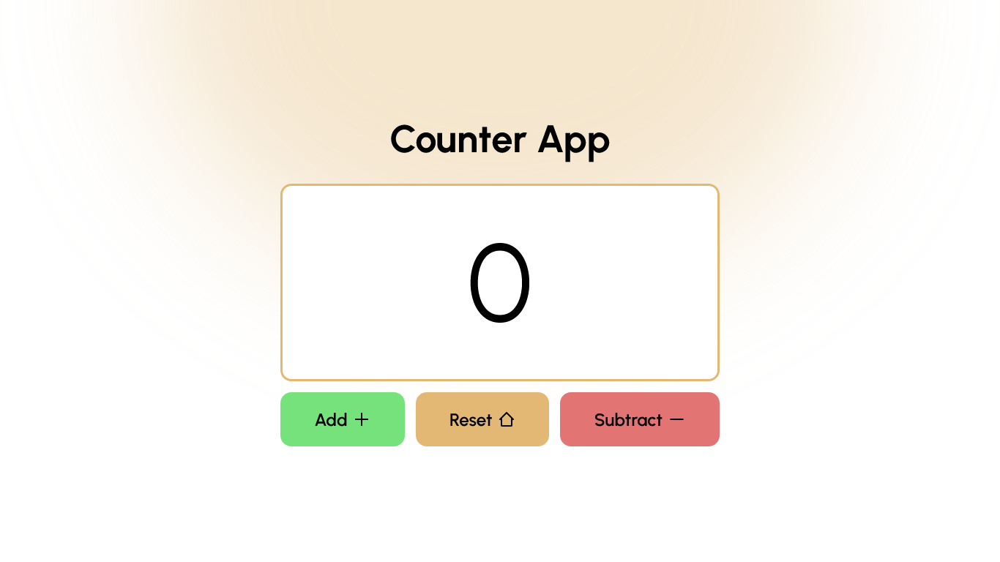

# 🔢 Interactive Counter App

A simple, fully **accessible**, and **responsive** web application built with **HTML, CSS and JavaScript** to demonstrate front-end fundamentals. This app allows users to track and manage a numerical count through a clean, intuitive interface.

## 🖼️ Project Preview


## ✨ Features

* **Increment & Decrement:** Easily add one or subtract one from the current count.
* **Reset Functionality:** Instantly set the counter back to zero.
* **Keyboard Controls:** Seamless control using **Up Arrow** ($\uparrow$) for Add, **Down Arrow** ($\downarrow$) for Subtract, and **Enter** for Reset.
* **Visual Feedback:** Clear hover states on all buttons for a satisfying user experience.
* **Fully Responsive:** Optimized for viewing and interaction on all screen sizes (mobile, tablet, and desktop).
* **Web Accessibility (A11y):** Implements **ARIA labels** and `aria-live` regions for screen reader compatibility, ensuring usability for everyone.
* **Lower Limit:** The count cannot go below zero, and the Subtract button is **automatically disabled** at `0`.

---

## 🛠️ Tech Stack

This project is built using core web technologies, ensuring it remains lightweight and easy to understand.

| Category | Technology | Purpose |
| :--- | :--- | :--- |
| **Structure** | **HTML5** | Semantic markup and foundation. |
| **Styling** | **CSS3** | Visual effects, responsiveness, and soft gradients. |
| **Logic** | **JavaScript (Vanilla)** | Core counting logic, DOM manipulation, and event handling. |

### Libraries

* **Google Fonts (Urbanist):** Provides a modern, clean typeface.
* **Boxicons:** Used for clean, vector-based icons on action buttons.

---

## 🚀 Getting Started

To run this project locally, follow these simple steps.

### Prerequisites

You only need a modern web browser (like Chrome, Firefox, or Edge).

### Installation

1.  **Clone the repository:**
    ```bash
    git clone https://github.com/arcchetan/counter-app
    ```
2.  **Navigate to the project directory:**
    ```bash
    cd counter-app
    ```
3.  **Open the file:**
    Simply open the `index.html` file in your preferred web browser.

    > **Tip:** Alternatively, you can use a Live Server extension (if using VS Code) to run the project.

---

## 💡 Usage

| Action | Mouse/Tap | Keyboard Shortcut |
| :--- | :--- | :--- |
| **Add** | Click the **Add +** button. | **Up Arrow** ($\uparrow$) |
| **Subtract** | Click the **Subtract -** button. | **Down Arrow** ($\downarrow$) |
| **Reset** | Click the **Reset** button. | **Enter** |

---

## 🤝 Contributing

Contributions, issues, and feature requests are welcome! Feel free to open a pull request or submit an issue if you find any bugs or have suggestions for new features.

---

## 📄 License

This project is licensed under the **MIT License**.
